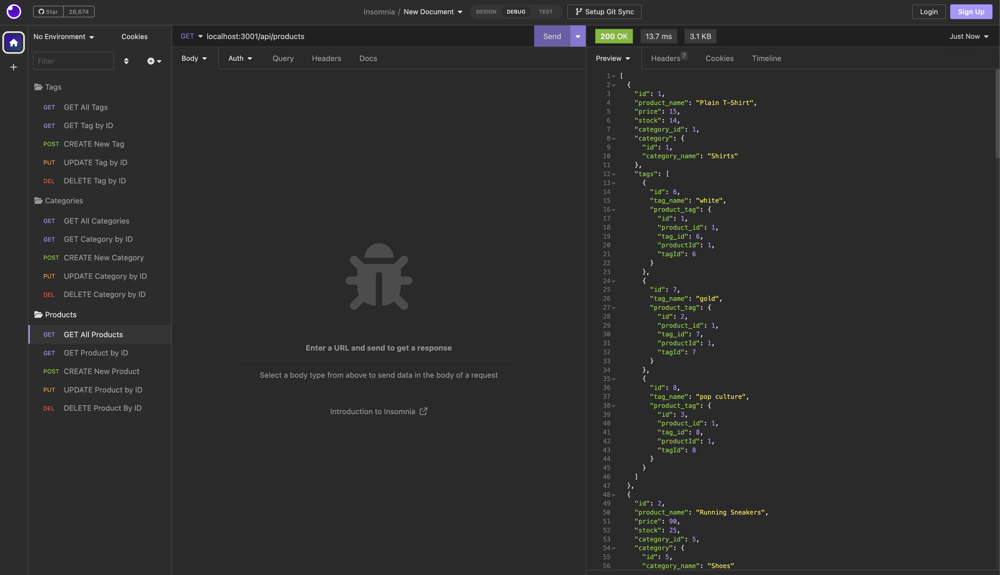
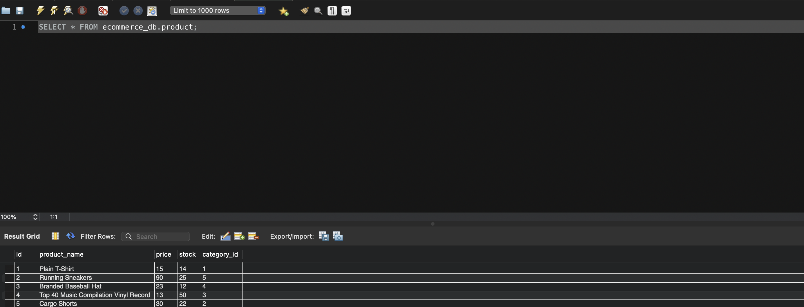

# E-Commerce Backend

The backend API integration for an e-commerce platform.

## Description

This API combines NodeJS and MySQL to create a functional backend to be implemented into an E-Commerce site.

# Table of Contents

1. [Installation](#installation)
2. [Usage](#usage)
3. [License](#license)
4. [Contributors](#contributors)
5. [Questions](#questions)

## Installation

      * Clone the repository onto your local environment
      * Navigate to the folder via your command line
      * Execute /db/schema.sql in MySQL workbench or similar to create the necessary database
      * Ensure that NodeJS and MySQL are installed, and that your MySQL server is up and running. Run `npm i` in your command line to install required packages. Run `npm run seed` to seed the database. Run `npm start` to start the server
      * You can now refer to the routes.js files to create JSON objects to pass in via Insomnia or similar tool. Feel free to test all available routes

## Usage

This project is a POC for a functional API interface for managing product category and tag integrations, and has tons of possible future development potential.

## License

Copyright 2023 @corynko

    Permission is hereby granted, free of charge, to any person obtaining
    a copy of this software and associated documentation files (the “Software”),
    to deal in the Software without restriction, including without limitation
    the rights to use, copy, modify, merge, publish, distribute, sublicense,
    and/or sell copies of the Software, and to permit persons to whom the
    Software is furnished to do so, subject to the following conditions:

    The above copyright notice and this permission notice shall be included in
    all copies or substantial portions of the Software.

    THE SOFTWARE IS PROVIDED “AS IS”, WITHOUT WARRANTY OF ANY KIND, EXPRESS OR
    IMPLIED, INCLUDING BUT NOT LIMITED TO THE WARRANTIES OF MERCHANTABILITY,
    FITNESS FOR A PARTICULAR PURPOSE AND NONINFRINGEMENT. IN NO EVENT SHALL THE
    AUTHORS OR COPYRIGHT HOLDERS BE LIABLE FOR ANY CLAIM, DAMAGES OR OTHER
    LIABILITY, WHETHER IN AN ACTION OF CONTRACT, TORT OR OTHERWISE, ARISING FROM,
    OUT OF OR IN CONNECTION WITH THE SOFTWARE OR THE USE OR OTHER DEALINGS IN THE SOFTWARE. -- For More Information, Please Visit https://opensource.org/license/mit/

## Contributors

This project was built upon starter code by @fantastic-umbrella, modified by @corynko. If you would like to contribute to this project, please reach out to @corynko via Github .

## Questions

Please don't hesitate to reach out to me at @corynko or open an issue on my repository with any questions or bugs.

- made using @corynko's readme generator -
